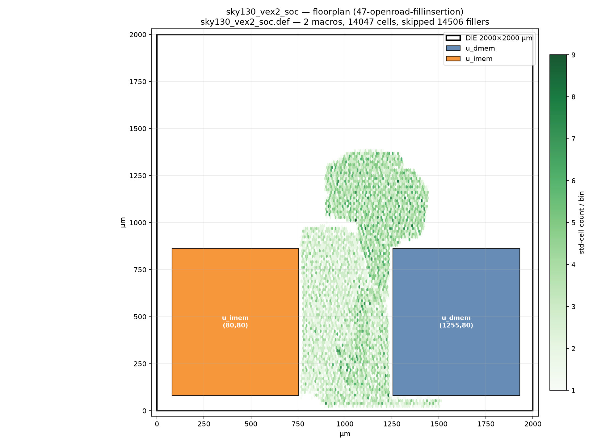
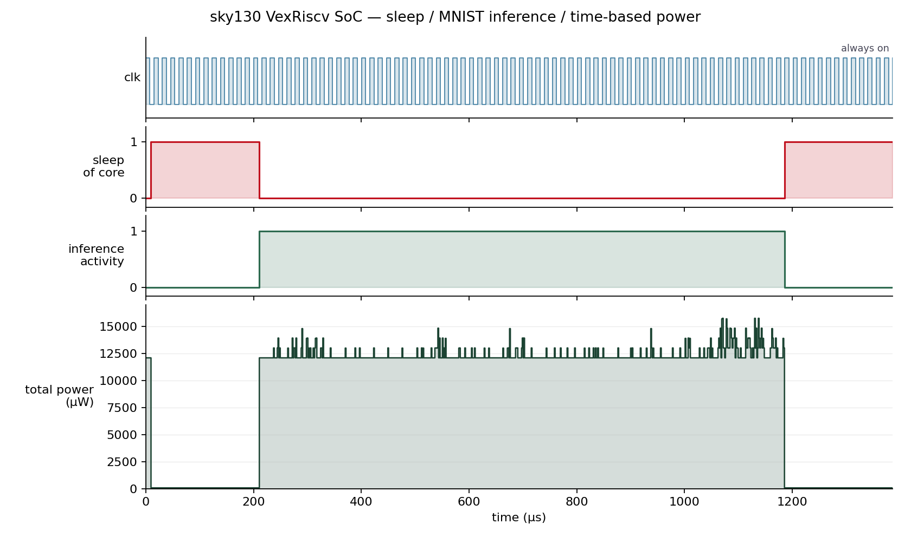

# sky130 VexRiscv + SRAM22 SoC — time-based power

Open-source path toward a tapeout-oriented RISC-V design on SkyWater 130 nm:
**VexRiscv** (four-stage pipeline) + **two SRAM22 macros**, with **clock-gated sleep** and
**windowed OpenSTA power** from a gate-level VCD.

<p align="center">
  
</p>

<p align="center"><em>Post-PnR floorplan — IMEM / DMEM macros + standard-cell logic</em></p>

<p align="center">
  
</p>

<p align="center"><em>Always-on <code>clk</code>, core sleep, MNIST inference, and total power (µW) vs time</em></p>

## Locked choices

| Block | Choice | Notes |
|-------|--------|--------|
| Core | `VexRiscv2` (decode/execute/memory/writeback, bypass, mul/div) | Generated from SpinalHDL; timing-oriented for a 60 MHz target |
| IMEM | `sram22_2048x32m8w8` | 2048 × 32 = **8 KiB** |
| DMEM | `sram22_2048x32m8w8` | same |

## Memory map

| Region | Address | Size |
|--------|---------|------|
| IMEM (fetch only) | `0x0000_0000` – `0x0000_1FFF` | 8 KiB |
| DMEM | `0x1000_0000` – `0x1000_1FFF` | 8 KiB |
| tohost | `0x2000_0000` | write nonzero → `halted`, core clocks gated |
| gpio | `0x2000_0004` | bit0 `done` handshake to TB |
| sleep | `0x2000_0008` | write 1 → clock-gate sleep until `wake` |
| status | `0x2000_000C` | bit0 `sleeping` (RO) |
| wake | pin | TB rising edge wakes core + pulses `externalInterrupt` |

Firmware schedule (MNIST TB): init → **sleep** → wake → **inference** → **sleep** → halt.

## Repository layout

```
setup/          install PDK, Nix, OpenLane, toolchains
rtl/            CPU, sleep/ICG, SoC bridges, SRAM behavioral link
firmware/       bare-metal MNIST MLP (+ sleep/wake handshake)
simulation/     Icarus RTL + gate-level sims + VCD waveforms
synthesis/      OpenLane config + run_synthesis.sh
power/          average + time-windowed OpenSTA power from VCD
docs/figures/   floorplan + power-timeline plots
third_party/    VexRiscv, sram22_sky130_macros (fetch via setup/)
```

## Quick start — time-based power

```bash
# Tools + PDK (once)
cd setup && ./install_nix.sh && ./install_pdk.sh && ./install_openlane.sh
./install_oss_cad_suite.sh && ./install_riscv_toolchain.sh && ./fetch_third_party.sh
cd ..
source env.sh

# 1) Synthesize (CLOCK_PERIOD in synthesis/sky130_vex2_soc/config.yaml)
./synthesis/run_synthesis.sh

# 2) Gate-level sim with SDF → activity VCD
./simulation/run_gls.sh fw --vcd          # → simulation/waveform_gls.vcd

# 3) Windowed power timeline (default N=1000 equal slots)
./power/run_time_power.sh ./simulation/waveform_gls.vcd
# → power/out_waveform_gls_time/power_vs_time.vcd|.csv

# 4) Refresh the README figure (optional)
python3 power/plot_power_timeline.py
```

Average energy for the whole run (same activity model):

```bash
./power/run_avg_power.sh ./simulation/waveform_gls.vcd
```

RTL bring-up (no power accuracy):

```bash
./simulation/run_sim.sh fw --vcd
```

Each of `setup/`, `simulation/`, `synthesis/`, `power/`, and `firmware/` has its own README.

## Shared paths

| Path | Purpose |
|------|---------|
| `/media/pdk` | `PDK_ROOT` (sky130A via volare) |
| `/media/hardware_design_tools` | OpenLane, OSS CAD Suite, volare venv |

```bash
source env.sh
```
